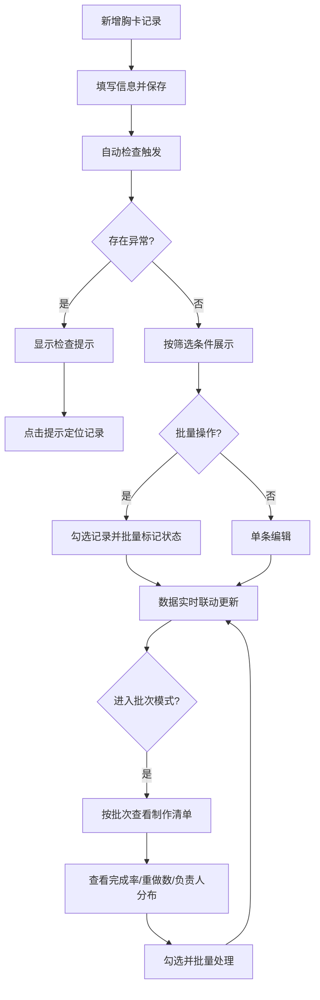

## 1. 产品概述

展会胸卡制作清单管理工具，帮助展会筹备团队高效管理入场胸卡的设计、打印、分发全流程。面向展会组织者和志愿者，解决胸卡制作状态混乱、批次颜色不一致、领取追踪困难等痛点。

## 2. 核心功能

### 2.2 功能模块

1. **清单主页**：顶部统计栏、左侧筛选区、下方分组卡片列表
2. **批次制作模式**：按打印批次生成可勾选清单、批次完成率与负责人分布

### 2.3 页面详情

| 页面名称 | 模块名称 | 功能描述 |
|----------|----------|----------|
| 清单主页 | 顶部统计栏 | 显示总记录数、各状态数量、问题提示数量 |
| 清单主页 | 左侧筛选区 | 按参会类型、颜色、批次、负责人、状态筛选 |
| 清单主页 | 分组卡片列表 | 按颜色分组展示胸卡记录，支持新增、编辑、批量操作 |
| 清单主页 | 自动检查面板 | 检测姓名重复、批次颜色混乱、负责人空缺、已领取无批次，点击定位 |
| 清单主页 | 新增/编辑弹窗 | 填写姓名、单位简称、参会类型、胸卡颜色、打印批次、领取状态、备注、负责人 |
| 清单主页 | 批量操作工具栏 | 批量标记"待设计""待打印""待领取""已领取""需重做" |
| 批次制作模式 | 批次选择器 | 按打印批次切换，显示可勾选的制作清单 |
| 批次制作模式 | 批次统计 | 每批次完成率、需重做数量、负责人分布 |
| 批次制作模式 | 批次操作 | 勾选后批量修改状态 |

## 3. 核心流程

## 4. 用户界面设计

### 4.1 设计风格

- 主色：深青 (#0D9488)，辅色：琥珀 (#F59E0B)，中性色：石板灰 (#475569)
- 按钮风格：圆角（8px），状态按钮使用对应颜色标签
- 字体：思源黑体 / Noto Sans SC，标题 18px 粗体，正文 14px 常规，注释 12px
- 布局：卡片式布局，顶部统计栏固定，左侧筛选区 240px 宽，右侧主内容区弹性宽度
- 图标：使用 lucide-vue-next 图标库

### 4.2 页面设计概览

| 页面名称 | 模块名称 | UI 元素 |
|----------|----------|----------|
| 清单主页 | 顶部统计栏 | 横向卡片组，各状态数字+图标，问题提醒红色徽章 |
| 清单主页 | 左侧筛选区 | 垂直排列的下拉选择器与标签组，可折叠 |
| 清单主页 | 分组卡片列表 | 按颜色分组的卡片，每卡片含8字段，颜色侧边条 |
| 清单主页 | 检查提示 | 浮动警告条，点击跳转，可展开详情 |
| 清单主页 | 新增/编辑弹窗 | 居中弹窗，表单8字段，底部操作按钮 |
| 批次制作模式 | 批次选择 | 水平标签页切换批次 |
| 批次制作模式 | 清单表格 | 可勾选行，状态标签，进度条 |

### 4.3 响应式

桌面优先设计，1280px 以上最佳体验。1024px 以下筛选区折叠为顶部抽屉，卡片单列展示。768px 以下全宽布局。

### 4.4 胸卡颜色对应

| 颜色名称 | 色值 | 用途 |
|----------|------|------|
| 红色 | #EF4444 | VIP / 嘉宾 |
| 蓝色 | #3B82F6 | 参展商 |
| 绿色 | #22C55E | 观众 |
| 黄色 | #EAB308 | 工作人员 |
| 紫色 | #A855F7 | 媒体 |
| 橙色 | #F97316 | 志愿者 |
| 灰色 | #6B7280 | 其他 |
