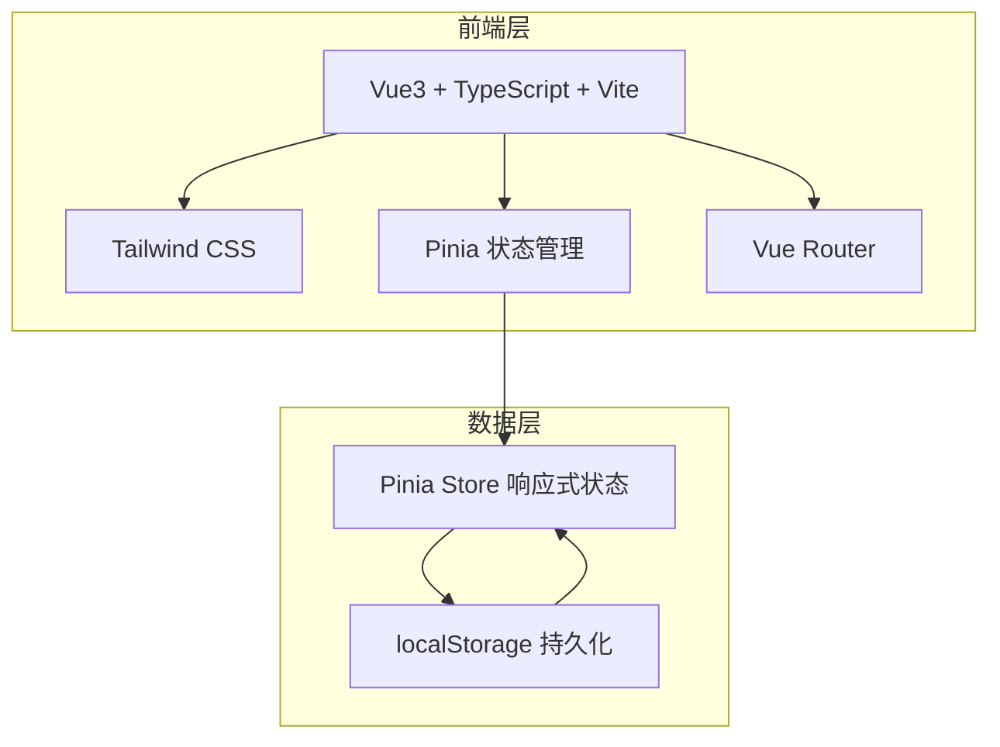
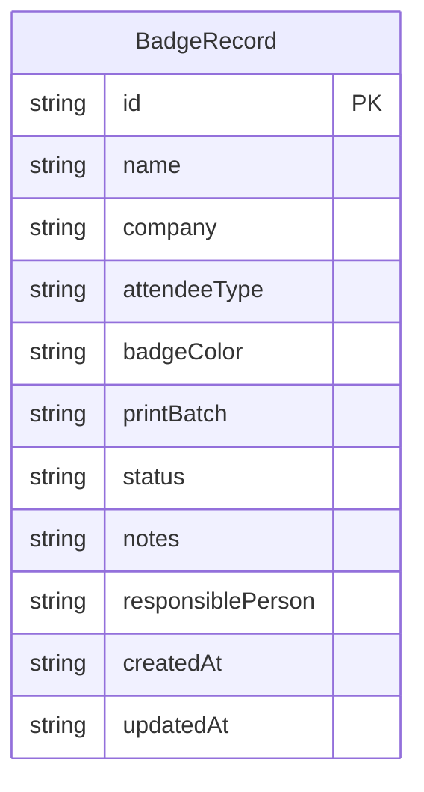

## 1. 架构设计



## 2. 技术说明

- 前端：Vue3 + TypeScript + Vite + Tailwind CSS
- 初始化工具：vite-init (vue-ts 模板)
- 状态管理：Pinia（响应式 + localStorage 同步）
- 后端：无（纯前端）
- 数据库：localStorage
- 图标：lucide-vue-next

## 3. 路由定义

| 路由 | 用途 |
|------|------|
| / | 清单主页（含常规模式和批次制作模式切换） |

## 4. 数据模型

### 4.1 数据模型定义



### 4.2 数据定义

```typescript
interface BadgeRecord {
  id: string
  name: string
  company: string
  attendeeType: string
  badgeColor: string
  printBatch: string
  status: '待设计' | '待打印' | '待领取' | '已领取' | '需重做'
  notes: string
  responsiblePerson: string
  createdAt: string
  updatedAt: string
}

interface CheckIssue {
  type: 'duplicate_name' | 'batch_color_mismatch' | 'missing_responsible' | 'collected_no_batch'
  recordIds: string[]
  message: string
}

interface FilterState {
  attendeeType: string
  badgeColor: string
  printBatch: string
  responsiblePerson: string
  status: string
  searchName: string
}
```

### 4.3 枚举值

- **参会类型**: 嘉宾、参展商、观众、工作人员、媒体、志愿者、其他
- **胸卡颜色**: 红色、蓝色、绿色、黄色、紫色、橙色、灰色
- **打印批次**: 用户自由填写（如 A1、A2、B1 等）
- **领取状态**: 待设计、待打印、待领取、已领取、需重做

## 5. 核心计算逻辑

### 5.1 自动检查规则

| 检查类型 | 规则 | 严重程度 |
|----------|------|----------|
| 姓名重复 | 同名记录 ≥ 2 | 警告 |
| 批次颜色混乱 | 同一打印批次内存在不同颜色 | 错误 |
| 负责人空缺 | 记录状态非"待设计"但负责人为空 | 警告 |
| 已领取无批次 | 状态为"已领取"但打印批次为空 | 错误 |

### 5.2 批次统计

- 完成率 = 已领取数 / 批次总数 × 100%
- 需重做数 = 状态为"需重做"的记录数
- 负责人分布 = 按负责人分组计数

## 6. 组件结构

```
src/
  components/
    StatsBar.vue           # 顶部统计栏
    FilterPanel.vue        # 左侧筛选区
    BadgeCard.vue          # 单条胸卡卡片
    BadgeCardGroup.vue     # 按颜色分组的卡片组
    RecordFormModal.vue    # 新增/编辑弹窗
    BatchToolbar.vue       # 批量操作工具栏
    CheckPanel.vue         # 自动检查提示面板
    BatchMode.vue          # 批次制作模式
    BatchSelector.vue      # 批次选择器
    BatchStats.vue         # 批次统计面板
  composables/
    useBadgeStore.ts       # Pinia Store + localStorage 同步
    useChecks.ts           # 自动检查逻辑
    useFilters.ts          # 筛选逻辑
    useBatchMode.ts        # 批次制作模式逻辑
  types/
    index.ts               # TypeScript 类型定义
  pages/
    HomePage.vue           # 主页面
```
